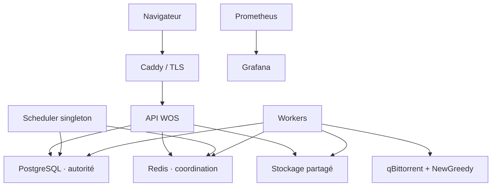

# Architecture de World of Seeds V2

## Statut et branches

World of Seeds V2 est la ligne active. La version stable actuellement en production est `2.0.0` sur Rise2. La V1 `1.3.3` n'est plus qu'une référence historique/rollback.

- `master` porte la production V2 ;
- `develop` est la branche d'intégration V2 ;
- `develop_V2` est historique et ne reçoit plus de nouveaux travaux ;
- chaque changement part du dernier `develop`, passe par une branche dédiée et une PR vers `develop` ;
- une promotion production passe ensuite par une PR `develop -> master`.

Les branches protégées exigent les checks backend, frontend, image conteneur, sécurité dépendances/image et policy de déploiement Rise2.

## Topologie



Seul l'ingress publie 80/443. PostgreSQL, Redis, qBittorrent, NewGreedy et les exporters restent sur les réseaux internes. L'API, les workers et le scheduler utilisent la même image applicative avec des commandes distinctes.

## Autorité et modèle métier

PostgreSQL est l'autorité de l'état métier et des jobs critiques. Redis accélère la coordination mais sa perte ne doit ni perdre un job ni autoriser une suppression. qBittorrent exécute les torrents mais n'est pas l'autorité des droits utilisateur.

| Entité | Rôle |
| --- | --- |
| `ManagedTorrent` | Torrent physique WOS partagé, infohash unique et clé de stockage serveur |
| `TorrentRequest` | Demande et droit d'un utilisateur sur un `ManagedTorrent` |
| `TorrentFile` | Manifeste validé des fichiers et chemins relatifs |
| `TorrentJob` | Travail durable, claimable et idempotent |
| `DownloadLease` | Protection temporaire d'un contenu servi contre la purge |
| `TrackerActivity` | Diagnostic tracker expurgé des secrets |

Deux uploads concurrents du même infohash convergent vers une seule copie physique et plusieurs `TorrentRequest`. Une annulation ou suppression de compte retire uniquement les droits concernés. Si aucune demande active ne reste, le lifecycle existant applique rétention puis purge ; il n'existe pas de second système de corbeille métier.

## Jobs, scheduler et reprise

Les jobs durables vivent en PostgreSQL. Les workers les claim avec expiration, retries bornés, backoff et vérification d'idempotence. Une réponse qBittorrent ambiguë est réconciliée par infohash avant toute répétition.

Le scheduler détient une lease singleton PostgreSQL, applique l'équité pondérée, les plafonds de concurrence et les limites de débit, et suspend les nouvelles admissions sous pression disque critique. Ses décisions désirées sont persistées avant les effets qBittorrent afin qu'un nouveau propriétaire de lease puisse reprendre après crash.

## Stockage partagé

```text
/data/
├── content/<storage-key>/   # copies physiques partagées gérées par SharedContentStore
├── control/                 # états techniques non publics
└── work/                    # temporaires techniques bornés, lorsque requis
```

Le runtime moderne n'a aucun workspace métier `/data/<username>` et aucune corbeille utilisateur. `SharedContentStore` est l'autorité filesystem du contenu torrent et utilise des clés UUID générées par le serveur. Le client ne fournit jamais de chemin hôte ou de destination qBittorrent.

Les chemins du manifeste `TorrentFile` restent relatifs, validés et bornés. Les ouvertures sensibles refusent les chemins absolus, `..`, les évasions de racine et les symlinks ; les primitives utilisent des descripteurs et `O_NOFOLLOW` lorsque nécessaire.

`GET /api/v2/storage` expose seulement la capacité partagée utile au Dashboard (`total_bytes`, `used_bytes`, `available_bytes`) et ne réintroduit aucun navigateur de fichiers.

## READY et récupération locale

Un utilisateur ne peut récupérer que les fichiers d'un `TorrentRequest` READY qui lui appartient. Le serveur produit un snapshot de manifeste stable, conserve les contrôles HTTP Range/ETag, les leases et les limites de concurrence, et peut streamer un ZIP borné lorsqu'il est disponible.

La récupération récursive principale est pilotée par le navigateur à partir du manifeste. Sa file est locale au navigateur : elle n'est jamais présentée comme une file globale autoritaire multi-appareils.

## Authentification et suppression de compte

Les sessions sont opaques, révocables et protégées par CSRF. Les routes métier résolvent l'utilisateur côté serveur ; aucun username fourni par le client ne détermine un chemin ou un droit de contenu.

La suppression d'un accès administré révoque les sessions, désactive le compte et annule ses demandes torrent actives via le même service métier que l'annulation utilisateur. Une copie partagée reste présente si d'autres demandes actives existent ; la dernière référence suit la rétention et la purge normales.

## Trackers, qBittorrent et NewGreedy

Les métainfo torrent sont parsés strictement et l'infohash est calculé depuis les octets bruts exacts du dictionnaire `info`. Les trackers sont allowlistés. Les passkeys et credentials restent dans les secrets d'infrastructure et ne sont jamais persistés dans les tables métier, logs, métriques ou réponses frontend.

qBittorrent et NewGreedy sont internes à Rise2. Le scheduler est l'autorité des décisions start/stop WOS et les effets destructifs qB sont bornés aux torrents portant l'identité WOS. V2-32D reste bloqué tant que NewGreedy ne fournit pas une suppression exacte et durable par SHA-1 complet ; aucun contournement par préfixe/reset global/édition directe n'est autorisé.

## Configuration, observabilité et sécurité

Les options fonctionnelles sûres sont typées, bornées, auditées et stockées en PostgreSQL. Secrets, URLs internes, chemins hôte, ports, UID/GID et clés restent dans le déploiement.

Prometheus/Grafana couvrent API, workers, scheduler, PostgreSQL, Redis, qBittorrent, stockage, hôte et conteneurs. Les métriques et logs ne portent ni passkey, ni chemin hôte utilisateur, ni infohash complet comme label.

## Déploiement Rise2 et rollback

Le checkout opérateur est `/opt/world-of-seeds-v2`, l'environnement `/etc/world-of-seeds-v2/environment` et le Compose production `deploy/compose.rise2.v2.yaml`.

Le workflow `Deploy V2 to Rise2` déploie le SHA `master` dont la CI a réussi, construit/publie une image immuable et déploie son digest. Le canal standard recrée uniquement la couche applicative nécessaire ; PostgreSQL, Redis, qBittorrent, NewGreedy et les volumes persistants doivent rester présents.

Le rollback applicatif redéploie un digest compatible. Les migrations destructives suivent une stratégie explicitement réversible/expand-contract et les opérations de stockage physique requièrent un plan OPS et un rollback dédié. `docker compose down --volumes` n'appartient jamais à un déploiement ou rollback ordinaire.

Le détail opératoire reste dans [`deployment-rise2-v2.md`](deployment-rise2-v2.md).
