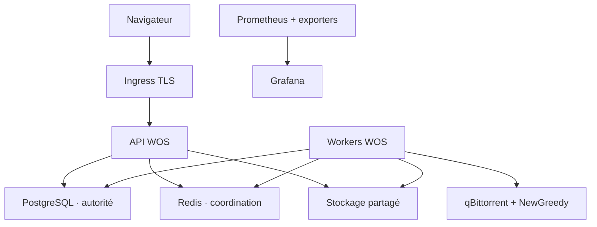

# Architecture cible de World of Seeds V2

## Statut, baseline et frontières de livraison

Ce document décrit la cible V2 ; il ne déclenche aucune modification fonctionnelle de la
V1. La baseline de départ est la release stable `1.3.3`.

- `master` reste la production V1 stable.
- `develop` reste la branche de préservation et de maintenance V1.
- `develop_V2` est la branche permanente d'intégration V2.
- Chaque tâche V2 part du dernier `develop_V2` et revient par pull request vers
  `develop_V2`.
- Aucune fonctionnalité V2 ne cible directement `develop` ou `master`.
- La V2 sera déployée sur l'hôte Rise2 dans une pile, des secrets, des volumes et une
  supervision séparés de la V1.

Les protections V1 restent des invariants : sessions opaques, CSRF, contrôle de rôle,
chemins relatifs au workspace, opérations filesystem par descripteurs, refus des symlinks,
conteneurs non-root, ports privés, absence de socket Docker et CSP stricte.

## Topologie cible



L'API et les workers utilisent la même image mais des commandes et services Compose
distincts. Seul l'ingress publie HTTP(S). PostgreSQL, Redis, qBittorrent, NewGreedy et les
exporters restent sur des réseaux internes. Le navigateur ne parle jamais directement aux
services torrent. Le choix final de l'ingress et ses règles TLS fait l'objet d'une tâche
dédiée, afin de ne pas figer un produit avant l'inventaire Rise2.

### Services Compose V2

| Service | Responsabilité | Persistance/exposition |
| --- | --- | --- |
| `api` | Authentification, API métier, flux de fichiers | Aucun port public direct |
| `scheduler` | Admission, équité, création des jobs | PostgreSQL ; singleton avec lease |
| `worker` | Ajout qB, sync, manifestes, purge, réconciliation | Réplicable ; accès stockage |
| `postgres` | Autorité métier et jobs durables | Volume dédié, réseau privé |
| `redis` | Réveil de workers, cache, compteurs courts | Volume/config dédiée, réseau privé |
| `qbittorrent` | Exécution des torrents WOS V2 | Volume/config et données V2 dédiés |
| `newgreedy` | Intégration tracker/proxy prévue | Réseau torrent interne uniquement |
| `ingress` | TLS, limites HTTP, routage vers l'API | Seuls ports publics 80/443 |
| `prometheus` | Collecte et règles d'alerte | Volume métriques dédié |
| `grafana` | Tableaux de bord d'exploitation | Accès admin protégé |
| `node-exporter` | Métriques hôte | Lecture hôte minimale et documentée |
| `cadvisor` | Métriques conteneurs | Accès technique borné, jamais depuis WOS |

Des exporters PostgreSQL et Redis sont ajoutés si leurs métriques ne sont pas couvertes de
façon sûre. Les accès privilégiés de supervision sont isolés de l'application.

## Autorité et modèle métier

PostgreSQL est l'autorité de tout état métier et de tout travail critique. Redis accélère
les lectures, signale les jobs disponibles et porte des compteurs éphémères ; sa perte ne
doit ni perdre un job ni autoriser une suppression.

| Entité | Rôle et invariants principaux |
| --- | --- |
| `ManagedTorrent` | Un torrent physique WOS, infohash unique, chemin géré unique |
| `TorrentRequest` | Demande et droit d'accès d'un utilisateur à un torrent partagé |
| `TorrentFile` | Manifeste validé des fichiers, tailles et chemins relatifs sûrs |
| `TrackerActivity` | Événements tracker expurgés de toute passkey et donnée sensible |
| `TorrentJob` | Travail durable, idempotent, claimable, temporisé et rejouable |
| `DownloadLease` | Protection temporaire d'un contenu servi contre la purge |

`ManagedTorrent.info_hash` est couvert par une contrainte `UNIQUE`. Deux uploads
concurrents du même torrent convergent donc vers un seul contenu physique et deux
`TorrentRequest`. Une annulation retire seulement la référence de son propriétaire. Une
purge exige zéro demande active, zéro lease valide et une rétention expirée.

Les anciennes lignes V1 `UserTorrent` ne sont pas transformées implicitement. Une migration
d'import explicite, idempotente et réversible sera conçue après validation du modèle V2.

## Jobs durables et reprise

`TorrentJob` utilise les états métier `QUEUED`, `RUNNING`, `COMPLETED`, `FAILED` et
`CANCELLED`. Les reprises utilisent `attempt_count`, `max_attempts`, `available_at`,
`timeout_at`, `claimed_by` et `claim_expires_at`, sans état critique uniquement dans Redis.

1. L'API écrit la demande, le torrent géré et le job dans une même transaction.
2. Après commit, elle publie au mieux un signal Redis.
3. Un worker claim le job par verrou SQL avec expiration.
4. Chaque effet externe porte une clé d'idempotence et est vérifié avant répétition.
5. Une erreur temporaire remet le job `QUEUED` avec backoff et jitter.
6. Une erreur permanente ou des essais épuisés produit `FAILED` et un diagnostic expurgé.
7. Une interruption autorisée produit `CANCELLED`; un worker mort est repris après
   expiration de son claim.

L'ajout qBittorrent est toujours réconcilié par infohash après une réponse ambiguë. Ainsi,
un timeout survenu après acceptation ne crée ni faux échec ni second torrent.

Le dépôt durable destiné au worker contient uniquement un métainfo tracker assaini : les
URLs déposées par l'utilisateur sont validées puis réécrites sans passkey avant la première
écriture disque. Le fichier privé est nommé par la clé de stockage opaque, lu sans suivre de
symlink, puis supprimé après l'ajout réconcilié. La passkey d'infrastructure n'est injectée
qu'en mémoire, entre le contrôle NewGreedy et l'appel qBittorrent.

Le worker crée périodiquement des jobs `SYNC_TORRENT` pour un ensemble borné de torrents.
Un index partiel garantit au plus un sync `QUEUED` ou `RUNNING` par torrent, même avec plusieurs
workers ou pendant une panne qB. Chaque lecture valide d'abord le chemin, la catégorie et les
tags WOS de l'infohash avant de normaliser l'état qB vers l'état métier et les demandes actives.

## Ordonnancement équitable et bande passante

Le scheduler applique une file équitable pondérée par utilisateur, avec vieillissement :

- quota de concurrence global et par utilisateur ;
- classes de taille pour favoriser un petit téléchargement sans bloquer les grands ;
- déficit accumulé/poids utilisateur pour garantir qu'un grand job progresse ;
- bonus d'attente borné afin qu'aucune demande ne soit affamée ;
- admission suspendue sous pression disque critique ; les jobs actifs restent observables ;
- limites de débit appliquées centralement via qBittorrent et les flux HTTP WOS.

Les poids, plafonds et seuils sont des options administratives typées. Le client ne fournit
ni priorité absolue ni chemin de destination. Les choix algorithmiques et scénarios de
non-famine sont testés par simulation avant leur connexion à qBittorrent.

Le runtime du scheduler détient une lease singleton en PostgreSQL. Il persiste dans la même
transaction son ledger d'équité et, pour chaque torrent contrôlé, la génération, l'admission,
le rang et le débit désirés avant tout appel qBittorrent. L'application de cette génération est
marquée séparément après succès ; un crash laisse donc un état désiré non appliqué qu'un nouveau
propriétaire de la lease peut réconcilier sans reconstruire l'équité depuis zéro.

## Stockage, quotas et pression disque

```text
<V2_STORAGE_ROOT>/
├── content/<managed-torrent-id>/   # copie physique partagée
├── trash/<user-id>/                # corbeille sécurisée V2
├── control/                         # états techniques non publics
└── work/                            # temporaires bornés et récupérables
```

Le chemin hôte est une variable d'infrastructure et n'est jamais renvoyé par l'API. Les
utilisateurs voient des références virtuelles autorisées au contenu ; aucun symlink n'est
créé dans leur workspace. Le manifeste `TorrentFile` et des compteurs transactionnels
alimentent les quotas : aucune requête web ne lance un parcours récursif du stockage.

Un reconciler lent et borné compare périodiquement manifestes, qBittorrent et filesystem.
Les seuils d'espace libre et d'occupation passent l'admission en `warning` ou `critical`.
Les suppressions sont idempotentes, auditables et bloquées par les leases.

## Téléchargement récursif sans archive géante

Le téléchargement principal d'un dossier repose sur la File System Access API lorsqu'elle
est disponible :

1. l'API crée un snapshot de manifeste stable et autorisé ;
2. le navigateur choisit un dossier local ;
3. il crée les sous-dossiers et télécharge chaque fichier par HTTP Range ;
4. une concurrence bornée, par défaut faible, protège le serveur ;
5. pause, reprise et annulation conservent la progression locale et le snapshot serveur ;
6. les changements de manifeste sont détectés par version/ETag avant reprise.

Le serveur ne prépare donc pas 10 Go avant l'ouverture de la boîte de dialogue. Le fallback
est le téléchargement fichier par fichier ; un ZIP streamé, non recompressé et sans fichier
temporaire n'est proposé que pour les petits dossiers sous un seuil administrable.

## C411, secrets et comptes multiples

- Les hosts trackers restent sur allowlist et les URLs sont normalisées sans modifier les
  octets bruts du dictionnaire `info`.
- Les passkeys et credentials restent dans des secrets d'infrastructure, jamais dans les
  options, logs, métriques, erreurs, manifests ou événements `TrackerActivity`.
- La V2 prépare plusieurs comptes tracker/qB par références opaques. Si des secrets doivent
  être persistés, ils sont chiffrés par enveloppe avec une clé maître fournie hors base.
- NewGreedy et qBittorrent ne sont accessibles que par les workers via le réseau interne.
- Toute mutation qB est limitée aux torrents portant l'identité/catégorie WOS V2.

## Configuration administrative

Les options fonctionnelles sûres et modifiables à chaud sont stockées en PostgreSQL avec
type, bornes, version et audit. Exemples : quotas, concurrence, pondération, rétention,
seuils disque, délais, retries, TTL de cache et préférences d'interface.

Les secrets, URLs internes, chemins hôte, ports, UID/GID, clés TLS et clés de chiffrement
restent dans les variables/secrets du déploiement. L'interface n'offre jamais d'éditeur de
configuration brute. Les options nécessitant un redémarrage indiquent explicitement leur
état appliqué et leur état désiré.

## API et expérience utilisateur

- Les listes sont paginées, requêtées en lots et ne déclenchent aucun scan récursif.
- Les erreurs suivent un contrat stable (`code`, `message`, `field`, `correlation_id`).
- Les confirmations et notifications sont des composants React internes, accessibles et
  sans style inline ; aucune dépendance de modal externe n'est requise.
- Une suppression définitive depuis la corbeille exige une confirmation explicite.
- Les tableaux utilisent des colonnes bornées, ellipsis et actions sur une ligne.
- La mise en page réagit aux changements d'orientation sans rechargement, avec tests aux
  largeurs V1 déjà couvertes et en paysage mobile/tablette.

## Observabilité et sécurité opérationnelle

Chaque requête et job reçoit un identifiant de corrélation. Les métriques portent sur le
nombre de jobs par état, âge de file, retries, durée des jobs, débit, pression disque,
latence API/DB/Redis/qB, leases et erreurs expurgées. Les labels n'incluent jamais user ID,
nom de fichier, infohash complet, tracker ou passkey.

Les dashboards couvrent API, workers, scheduler, PostgreSQL, Redis, qBittorrent, stockage,
hôte et conteneurs. Les alertes minimales portent sur jobs bloqués, file vieillissante,
stockage critique, erreurs qB, DB/Redis indisponible, redémarrages et saturation CPU/RAM/I/O.

Les sauvegardes PostgreSQL et configurations sont chiffrées et testées par restauration.
Les données torrent volumineuses ont une politique explicite distincte. Les mises à jour
d'images sont épinglées ; les scans de dépendances et d'images sont intégrés avant release.

## Déploiement Rise2, migration et rollback

La procédure détaillée est dans [`deployment-rise2-v2.md`](deployment-rise2-v2.md). La
première installation V2 ne modifie pas les volumes, réseaux, secrets, base ou qB de la V1.
Les migrations Alembic s'exécutent contre la base Rise2 uniquement. La bascule d'utilisateurs
est précédée d'un pilote, d'une sauvegarde restaurée à blanc et d'un test de rollback.

Le rollback applicatif redéploie le dernier digest compatible. Toute migration destructive
est précédée d'au moins une release expand/contract. Le passage final de `develop_V2` vers
une release V2 stable sera défini et validé séparément ; il ne peut pas être assimilé à une
fusion automatique vers le `master` V1.
