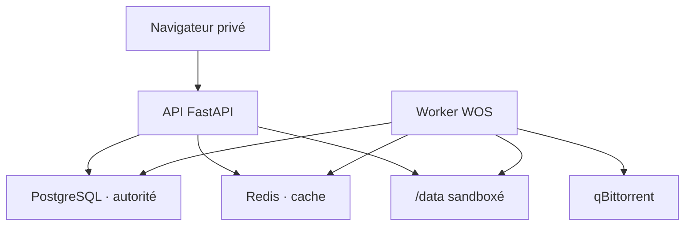

# Architecture cible de la V2

## Statut et principes

Ce document fixe les décisions d’architecture de la V2 avant leur implémentation. La
baseline applicative est la version `1.2.1`. La V2 étend la V1 sans remplacer ses
protections : sessions opaques, CSRF, isolation des workspaces, opérations filesystem par
descripteurs, conteneur non-root, port lié à l’interface locale et absence de socket Docker.

World of Seeds devient un orchestrateur de demandes de téléchargement. Plusieurs comptes
peuvent référencer le même contenu, mais WOS ne crée qu’un torrent qBittorrent et qu’une
copie physique. PostgreSQL est toujours capable de reconstruire l’état métier sans Redis.



L’API et le worker utiliseront la même image, mais des processus et services Compose
distincts. Le navigateur ne sonde jamais qBittorrent directement. Le worker centralise les
ajouts, la synchronisation, les reprises et la réconciliation ; l’API lit PostgreSQL et les
snapshots Redis.

## Frontières de sécurité

- L’application ne monte que `/srv/seedbox:/data` et les sous-chemins de contrôle prévus.
- Aucun composant WOS ne reçoit `/var/run/docker.sock`.
- Les chemins fournis par un utilisateur restent relatifs à sa racine autorisée ; les
  protections `*at`, `O_NOFOLLOW`, anti-traversal et anti-symlink de la V1 restent obligatoires.
- `.env` contient les secrets et paramètres d’infrastructure. Il n’est jamais lisible ou
  modifiable par l’interface web.
- `.options` ne contient que des réglages fonctionnels connus, typés et non sensibles.
- Seuls les torrents portant la catégorie WOS et connus en base peuvent être mutés ou purgés
  automatiquement. Les torrents historiques ou externes restent en lecture seule.
- Les URLs complètes de tracker, passkeys, mots de passe, chemins hôte et erreurs internes ne
  sont jamais renvoyés au navigateur ou écrits dans les logs applicatifs.
- Les redémarrages de services passent par un canal fichier borné et un helper systemd à
  commande fixe. Aucun argument web n’est interpolé dans une commande hôte.

## Stockage

```text
/srv/seedbox/
├── <username>/downloads/           # espace privé visible par l’utilisateur
├── .trash/<user-uuid>/             # corbeille gérée par WOS
├── .wos-content/<info-hash>/        # contenu physique partagé, V2
└── .wos-control/
    ├── .options                     # réglages fonctionnels persistants
    └── <service-control-channels>/  # requêtes/statuts systemd bornés
```

Le chemin partagé est vu par WOS sous `/data/.wos-content` et devra être monté dans
qBittorrent sous un chemin statique décidé au déploiement. Un save path libre fourni par le
navigateur est interdit. Les workspaces utilisateurs exposent des références ou des accès
contrôlés au contenu partagé ; ils ne créent pas une copie physique par demande.

## Autorité des données

| Donnée | PostgreSQL | Redis | Filesystem/qBittorrent |
| --- | --- | --- | --- |
| Utilisateurs, sessions, corbeille | Autorité | Cache éventuel borné | Effets contrôlés |
| `ManagedTorrent`, ownership, lifecycle | Autorité | Index et snapshots | qB est moteur d’exécution |
| `TorrentRequest` par utilisateur | Autorité | Liste rapide par utilisateur | Aucun état métier |
| Manifeste `TorrentFile` | Autorité | Cache de lecture éventuel | Contenu physique |
| Progression, vitesses, ETA | Dernier snapshot utile | Snapshot court prioritaire | qB est source opérationnelle |
| Rate limits et compteurs courts | Audit si nécessaire | Autorité volatile autorisée | Aucun |
| Leases de téléchargement | Persistance si la suppression en dépend | Accélération/coordination | Flux HTTP actif |

Une contrainte SQL `UNIQUE` sur l’info-hash garantit la déduplication. Un `SETNX` Redis ne
constitue jamais la garantie métier. Toute mutation persistante suit l’ordre : transaction
PostgreSQL, commit, puis invalidation ou mise à jour du cache. Une panne Redis déclenche un
fallback PostgreSQL et un état de santé dégradé, pas une erreur « introuvable ».

## Configuration fonctionnelle `.options`

Le fichier persistant prévu est `/srv/seedbox/.wos-control/.options`, monté dans le
conteneur via `/data/.wos-control/.options`. Le choix conserve le montage unique de la V1.
Le fichier réel n’est pas versionné ; `.options.example` le sera dans V2-01.

Le backend maintient une allowlist d’`OptionSpec`. Chaque entrée décrit : clé, type, valeur
par défaut, bornes, unité, catégorie, description, éditabilité, sensibilité et besoin de
redémarrage. Toute clé inconnue ou ressemblant à un secret est rejetée. L’admin manipule des
champs typés ; aucun textarea brut n’écrit le fichier.

Le format persistant est `KEY=value`, UTF-8, sans expansion de variable ni exécution. Les
écritures seront réalisées dans un fichier temporaire du même dossier, synchronisées, puis
publiées par `os.replace`; une sauvegarde bornée permettra le rollback. Les options
dynamiques sont appliquées après validation. Les autres sont enregistrées avec
`restart_required=true` et proposées au redémarrage contrôlé de WOS.

Les familles prévues sont : téléchargements HTTP, torrents, stockage, rétention, cache,
performance, sécurité fonctionnelle et interface. Les chemins hôte, URLs internes,
credentials et commandes restent exclusivement dans la configuration d’infrastructure.

## Redis et stratégie de cache

Redis sera ajouté en V2-02 avec une version explicitement épinglée après vérification de la
documentation officielle. Il n’aura aucun port hôte et ne rejoindra que le réseau Docker
backend interne. Les clés utilisent le préfixe `wos:v2:` et des TTL obligatoires lorsqu’une
donnée peut devenir obsolète.

Pattern de lecture :

1. lire le cache ;
2. sur hit valide, retourner la valeur ;
3. sur miss, lire PostgreSQL ;
4. remplir Redis avec un TTL ;
5. retourner la donnée PostgreSQL.

Les erreurs Redis sont bornées, journalisées sans boucle agressive et n’annulent pas les
opérations critiques. Après flush ou redémarrage, le cache est reconstruit à la demande et
par réconciliation depuis PostgreSQL et qBittorrent. Le health expose `healthy`, `degraded`
ou `unavailable`, avec au plus latence, mémoire et nombre de clés WOS.

## Domaine torrent

- `ManagedTorrent` représente l’unique torrent physique WOS, identifié par UUID et
  info-hash unique. Il porte lifecycle, état qB, progression, chemin géré, retry et purge.
- `TorrentRequest` représente la demande et les droits d’un utilisateur. Le couple
  `(user_id, managed_torrent_id)` est unique tant que la demande est active.
- `TorrentFile` conserve le manifeste validé. Il ne contient jamais l’URL complète d’un
  tracker.
- Un worker durable traite l’ajout qB, les retries exponentiels, le polling centralisé, la
  fin de téléchargement, la rétention et la réconciliation.

Deux créations concurrentes du même torrent convergent vers un `ManagedTorrent`, deux
`TorrentRequest` et un seul ajout qB. Une annulation retire uniquement la référence de son
propriétaire. Le contenu ne devient purgeable qu’après disparition de la dernière référence
et expiration de la rétention, sans lease de téléchargement active.

Les états et transitions autorisés sont détaillés dans
[`state-machines-v2.md`](state-machines-v2.md).

## API, erreurs et interface

Les nouvelles erreurs métier ont un contrat stable : `code`, `message`, `field` facultatif
et identifiant de corrélation non sensible. Le frontend affiche une erreur de champ près du
contrôle concerné et un résumé global lorsque cela aide ; un toast seul n’est pas suffisant
pour une erreur critique.

Les listes sont paginées et chargées en relations groupées afin d’éviter les N+1. Les
rafraîchissements du navigateur lisent l’API WOS ; ils ne multiplient pas le polling qB.
Les mutations restent protégées par session, rôle et CSRF.

## Version et artefact de release

`VERSION` est la source canonique. Les champs nécessaires aux écosystèmes Python, npm et au
runtime sont des miroirs vérifiés par `scripts/versioning.py`. La commande
`python3 scripts/versioning.py set X.Y.Z` les met à jour ensemble.

Une release stable suit cet ordre : validation des miroirs et du tag, création d’une release
en brouillon, construction de l’image depuis le SHA exact, vérification du label OCI
`org.opencontainers.image.version`, publication de la release, puis déploiement par digest.
La publication n’a donc pas lieu si le frontend, le backend, le tag ou l’image divergent.

## Déploiement et rollback

Chaque PR vise `develop`. Les releases fusionnent un lot validé vers `master`, créent un tag
immuable, construisent par SHA et déploient par digest. Les migrations sont compatibles avec
un redéploiement de l’image précédente tant qu’une PR n’annonce pas explicitement le
contraire. `.options` et Redis sont introduits par étapes ; la perte complète de Redis ne
demande aucune restauration de données.

Les invariants, variables, options, clés Redis, migrations, indexes, risques et procédure de
rollback sont consignés dans chaque PR selon [`roadmap-v2.md`](roadmap-v2.md).
