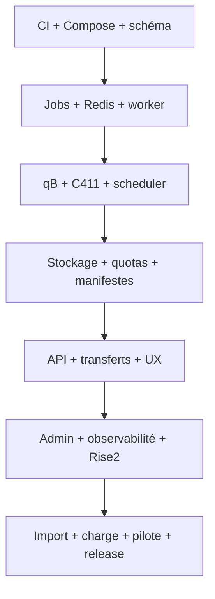

# Roadmap de réalisation de World of Seeds V2

## Règles d'exécution

- Une tâche équivaut en principe à une branche et une pull request ciblant `develop_V2`.
- La branche part du dernier `develop_V2`; elle ne part jamais de `master` ou `develop`.
- `master` et `develop` restent réservées à la V1 tant que le plan de release V2 n'est pas
  explicitement approuvé.
- Avant chaque tâche, lire seulement `docs/agent/CONTEXT.md` et
  `docs/agent/PROGRESS.md`, puis les fichiers strictement nécessaires.
- Mettre `PROGRESS.md` à jour à la fin. Modifier `CONTEXT.md` seulement pour une décision
  durable.
- Pas de refactor opportuniste. Tests ciblés pendant le développement, puis CI complète une
  seule fois avant merge.
- Chaque PR documente migrations, dépendances, configuration, sécurité, observabilité,
  compatibilité, rollback et dette résiduelle.

Niveaux Work : **RAPIDE** (changement local et faible risque), **MOYEN** (plusieurs couches
ou migration additive), **ÉLEVÉ** (concurrence, stockage, sécurité, déploiement ou migration
à fort impact).

## Ordre des tâches

| ID | Niveau | Dépend de | Portée d'une PR et critère de sortie |
| --- | --- | --- | --- |
| V2-00 | RAPIDE | — | Figé : architecture, roadmap, machines d'état, Rise2 et workflow `develop_V2`; aucun code fonctionnel. |
| V2-01 | MOYEN | V2-00 | Socle CI V2 : déclenchement sur `develop_V2`, checks inchangés pour V1, règles de version prérelease et artefacts séparés. |
| V2-02 | MOYEN | V2-01 | Compose local V2 minimal `api/postgres/redis`; images épinglées, réseaux privés, healthchecks et aucun port DB/Redis publié. |
| V2-03 | ÉLEVÉ | V2-02 | Schéma `ManagedTorrent`, `TorrentRequest`, `TorrentFile`; contraintes d'ownership/infohash, migration additive et rollback testé. |
| V2-04 | ÉLEVÉ | V2-03 | Schéma `TorrentJob`, claims SQL, timeouts, retries et annulation; tests de crash/reprise et concurrence. |
| V2-05 | MOYEN | V2-02 | Client Redis tolérant aux pannes : signal de queue, cache-aside, namespaces/TTL, health dégradé et reconstruction depuis PostgreSQL. |
| V2-06 | MOYEN | V2-03 | Registre d'options PostgreSQL typées et auditées; séparation stricte options dynamiques/secrets d'infrastructure. |
| V2-07 | MOYEN | V2-03 | Service de déduplication transactionnelle par infohash; deux requêtes concurrentes créent un torrent physique et deux droits. |
| V2-08 | ÉLEVÉ | V2-04,V2-05,V2-07 | Processus worker séparé, claim durable/idempotence, arrêt propre et récupération d'un job abandonné. |
| V2-09 | ÉLEVÉ | V2-08 | Gateway qBittorrent V2 : catégorie/identité WOS, save path fixe, vérification par infohash après réponse ambiguë, aucune mutation externe. |
| V2-10 | ÉLEVÉ | V2-09 | Intégration C411/NewGreedy : allowlist, normalisation sans modifier `info`, expurgation des secrets et réseau interne. |
| V2-11 | MOYEN | V2-10 | `TrackerActivity` sans secret, diagnostic borné et préparation de références opaques pour plusieurs comptes. |
| V2-12 | ÉLEVÉ | V2-04,V2-06 | Scheduler équitable pondéré : concurrence globale/par utilisateur, classes de taille, déficit et vieillissement anti-famine. |
| V2-13 | ÉLEVÉ | V2-09,V2-12 | Pilotage qB des priorités et débits; cohérence entre politique WOS, états qB et reprise après redémarrage. |
| V2-14 | ÉLEVÉ | V2-03,V2-08 | Stockage physique partagé par `ManagedTorrent`, chemins opaques, accès par descripteurs, aucun symlink ou scan récursif web. |
| V2-15 | ÉLEVÉ | V2-06,V2-14 | Quotas logiques, compteurs transactionnels, seuils disque et admission `warning/critical`; reconciler borné. |
| V2-16 | MOYEN | V2-14 | Génération et validation de manifestes `TorrentFile`; pagination, checksum/version et détection des changements. |
| V2-17 | MOYEN | V2-03,V2-09 | API de demandes torrent V2 et contrats d'erreur; dépôt idempotent et consultation sans polling qB par navigateur. |
| V2-18 | MOYEN | V2-17 | Interface « Mes téléchargements » V2 : états durables, progression, pagination, ellipsis, actions sur une ligne et CSP stricte. |
| V2-19 | ÉLEVÉ | V2-16,V2-17 | API de téléchargement par fichier : ownership, HTTP Range, ETag, limite de débit et `DownloadLease`. |
| V2-20 | ÉLEVÉ | V2-19 | Téléchargement récursif navigateur : File System Access API, snapshot manifeste, concurrence bornée, pause/reprise/annulation. |
| V2-21 | MOYEN | V2-20 | Fallback compatible : fichiers individuels et ZIP streamé réservé aux petits dossiers, sans archive temporaire. |
| V2-22 | ÉLEVÉ | V2-14,V2-19 | Lifecycle : annulation d'une référence partagée, rétention, leases, purge idempotente et course nouvelle-demande/purge. |
| V2-23 | MOYEN | V2-18,V2-22 | UX commune React : confirmations et toasts internes accessibles, suppression définitive confirmée, aucun style inline. |
| V2-24 | MOYEN | V2-18,V2-23 | Responsive complet : orientation dynamique, tableaux, modales, navigation et tests mobile/tablette portrait-paysage. |
| V2-25 | MOYEN | V2-06,V2-12,V2-15 | Administration centrale : options, quotas, scheduler, stockage et états appliqué/désiré avec audit. |
| V2-26 | ÉLEVÉ | V2-08,V2-09,V2-14 | Réconciliation admin : DB/qB/filesystem, anomalies actionnables, opérations bornées et torrents externes en lecture seule. |
| V2-27 | MOYEN | V2-08,V2-15 | Métriques applicatives sans cardinalité/secrets : API, jobs, scheduler, leases, qB, Redis, DB et stockage. |
| V2-28 | ÉLEVÉ | V2-02,V2-27 | Stack Prometheus/Grafana/node-exporter/cAdvisor, dashboards, alertes, rétention et accès admin isolé. |
| V2-29 | ÉLEVÉ | V2-09,V2-10,V2-28 | Compose Rise2 complet : ingress, API, workers, PG, Redis, qB, NewGreedy et monitoring sur réseaux/volumes V2 dédiés. |
| V2-30 | ÉLEVÉ | V2-29 | Sauvegarde/restauration : PostgreSQL, secrets/configs, qB et politique des données; exercice de restauration documenté. |
| V2-31 | ÉLEVÉ | V2-22,V2-26,V2-30 | Import V1 optionnel : inventaire, mapping `UserTorrent`, dry-run, idempotence, conflits et rollback sans toucher à V1. |
| V2-32 | ÉLEVÉ | V2-24,V2-28,V2-29 | Sécurité et charge : 100 comptes, pannes/latences, CPU/RAM/I/O, CSP, OWASP, scan dépendances/images et tests anti-famine. |
| V2-33 | ÉLEVÉ | V2-30,V2-31,V2-32 | Pilote Rise2 : données de test puis comptes pilotes, critères go/no-go, observation et retour arrière vérifié. |
| V2-34 | ÉLEVÉ | V2-33 | Release candidate V2 : gel fonctionnel, migrations expand/contract, runbook, compatibilité digest précédent et validation complète. |
| V2-35 | ÉLEVÉ | V2-34 | Release V2 stable : SemVer 2.0.0 seulement après approbation, bascule Rise2 progressive et conservation de la V1 pendant la fenêtre de rollback. |

## Chaîne de dépendances principale

Les branches parallélisables après le socle sont : options, Redis et domaine torrent ; puis
UX de lecture, observabilité et préparation Rise2. Le stockage partagé précède impérativement
les transferts récursifs et le lifecycle. La réconciliation précède l'import V1.

## Migrations et ruptures anticipées

| Sujet | Changement | Compatibilité/traitement |
| --- | --- | --- |
| Base | Six nouvelles entités et options SQL | Migrations additives d'abord ; expand/contract avant suppression |
| `UserTorrent` V1 | Ne couvre ni partage ni lifecycle | Conservé ; import explicite en V2-31, jamais conversion silencieuse |
| Stockage | Workspace par utilisateur vers contenu partagé virtuel | Volumes Rise2 séparés ; mapping manifeste, aucun déplacement manuel |
| qBittorrent | Instance externe V1 vers instance intégrée V2 | Profil/config/volume séparés ; import uniquement via API contrôlée |
| NewGreedy | Dépendance réseau externe vers service intégré | Secrets et réseau V2 dédiés ; aucune URL publique |
| Téléchargement dossier | ZIP principal vers transfert récursif | Feature detection ; fallback petit ZIP/fichiers individuels |
| Configuration | Registre fichier V1 vers options SQL V2 | Import allowlisté ; secrets restent hors DB |
| Déploiement | OVH V1 vers Rise2 V2 | Deux piles coexistantes ; DNS/bascule seulement après pilote |
| Version | Baseline `1.3.3` vers préreleases V2 | Aucun bump dans V2-00 ; stratégie fixée en V2-01 |

## Risques majeurs et parades

| Risque | Parade exigée avant release |
| --- | --- |
| Double ajout ou faux échec qB | Unicité SQL, idempotence, réconciliation infohash |
| Perte de jobs Redis/worker | PostgreSQL autoritaire, claims expirants, replay testé |
| Famine des gros torrents | Déficit + vieillissement, simulations et métriques d'âge |
| Saturation disque/I/O | Admission, manifestes, scans hors requête, quotas et alertes |
| Purge d'un contenu utilisé | Références partagées, leases SQL, verrou transactionnel |
| Fuite de passkey | Secrets hors options, redaction centralisée, tests logs/API/métriques |
| Régression filesystem V1 | Réutilisation des primitives sûres et tests traversal/symlink |
| Incompatibilité navigateur | Feature detection et fallback sans archive géante obligatoire |
| Privilèges monitoring | Réseaux isolés, mounts en lecture seule, aucun accès depuis WOS |
| Migration irréversible | Rise2 isolé, dry-run, sauvegarde restaurée, expand/contract |

## Validation requise par PR

1. Tests unitaires ciblés et tests de concurrence/sécurité associés au changement.
2. Lint, format et typecheck des couches touchées.
3. Test d'intégration uniquement lorsque la PR modifie un contrat de service.
4. `git diff --check`, recherche de secrets et revue des migrations/configurations.
5. Une seule exécution de la CI complète quand la branche est prête.
6. `PROGRESS.md` mis à jour avec SHA, PR, validations, risques et prochaine tâche.

## Première tâche proposée

`V2-01 — Socle CI et versionnement V2` est la première PR fonctionnelle. Elle doit partir
de `develop_V2`, ajouter les déclencheurs/checks de cette branche sans modifier les workflows
de release V1, choisir le format de prérelease V2 et prouver que les artefacts V1 et V2 ne
peuvent pas être déployés l'un à la place de l'autre.
