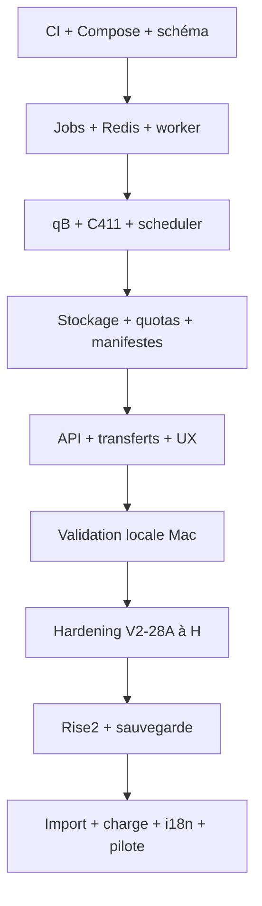

# Roadmap de réalisation de World of Seeds V2

## Règles d'exécution

- Une tâche équivaut en principe à une branche et une pull request ciblant `develop_V2`.
- La branche part du dernier `develop_V2`; elle ne part jamais de `master` ou `develop`.
- `master` et `develop` restent réservées à la V1 tant que le plan de release V2 n'est pas
  explicitement approuvé.
- Avant chaque tâche, lire seulement `docs/agent/CONTEXT.md` et
  `docs/agent/PROGRESS.md`, puis les fichiers strictement nécessaires.
- Mettre `PROGRESS.md` à jour à la fin. Modifier `CONTEXT.md` seulement pour une décision
  durable.
- Pas de refactor opportuniste. Tests ciblés pendant le développement, puis CI complète une
  seule fois avant merge.
- Chaque PR documente migrations, dépendances, configuration, sécurité, observabilité,
  compatibilité, rollback et dette résiduelle.

Niveaux Work : **RAPIDE** (changement local et faible risque), **MOYEN** (plusieurs couches
ou migration additive), **ÉLEVÉ** (concurrence, stockage, sécurité, déploiement ou migration
à fort impact).

## Ordre des tâches

| ID | Niveau | Dépend de | Portée d'une PR et critère de sortie |
| --- | --- | --- | --- |
| V2-00 | RAPIDE | — | Figé : architecture, roadmap, machines d'état, Rise2 et workflow `develop_V2`; aucun code fonctionnel. |
| V2-01 | MOYEN | V2-00 | Socle CI V2 : déclenchement sur `develop_V2`, checks inchangés pour V1, règles de version prérelease et artefacts séparés. |
| V2-02 | MOYEN | V2-01 | Compose local V2 minimal `api/postgres/redis`; images épinglées, réseaux privés, healthchecks et aucun port DB/Redis publié. |
| V2-03 | ÉLEVÉ | V2-02 | Schéma `ManagedTorrent`, `TorrentRequest`, `TorrentFile`; contraintes d'ownership/infohash, migration additive et rollback testé. |
| V2-04 | ÉLEVÉ | V2-03 | Schéma `TorrentJob`, claims SQL, timeouts, retries et annulation; tests de crash/reprise et concurrence. |
| V2-05 | MOYEN | V2-02 | Client Redis tolérant aux pannes : signal de queue, cache-aside, namespaces/TTL, health dégradé et reconstruction depuis PostgreSQL. |
| V2-06 | MOYEN | V2-03 | Registre d'options PostgreSQL typées et auditées; séparation stricte options dynamiques/secrets d'infrastructure. |
| V2-07 | MOYEN | V2-03 | Service de déduplication transactionnelle par infohash; deux requêtes concurrentes créent un torrent physique et deux droits. |
| V2-08 | ÉLEVÉ | V2-04,V2-05,V2-07 | Processus worker séparé, claim durable/idempotence, arrêt propre et récupération d'un job abandonné. |
| V2-09 | ÉLEVÉ | V2-08 | Gateway qBittorrent V2 : catégorie/identité WOS, save path fixe, vérification par infohash après réponse ambiguë, aucune mutation externe. |
| V2-10 | ÉLEVÉ | V2-09 | Intégration C411/NewGreedy : allowlist, normalisation sans modifier `info`, expurgation des secrets et réseau interne. |
| V2-11 | MOYEN | V2-10 | `TrackerActivity` sans secret, diagnostic borné et préparation de références opaques pour plusieurs comptes. |
| V2-12 | ÉLEVÉ | V2-04,V2-06 | Scheduler équitable pondéré : concurrence globale/par utilisateur, classes de taille, déficit et vieillissement anti-famine. |
| V2-13 | ÉLEVÉ | V2-09,V2-12 | Pilotage qB des priorités et débits; cohérence entre politique WOS, états qB et reprise après redémarrage. |
| V2-13A | ÉLEVÉ | V2-13 | Runtime scheduler singleton : lease SQL, ledger et état désiré/appliqué persistés, reprise après crash. |
| V2-13B | ÉLEVÉ | V2-08,V2-10,V2-11,V2-13A | Handlers worker réels : ajout C411/qB, transitions métier et synchronisation périodique bornée des états qB. |
| V2-13C | ÉLEVÉ | V2-11,V2-13B | Routage multi-comptes tracker/qB par références opaques, affectation stable et secrets limités au déploiement. |
| V2-14 | ÉLEVÉ | V2-03,V2-08,V2-13B | Stockage physique partagé par `ManagedTorrent`, chemins opaques, accès par descripteurs, aucun symlink ou scan récursif web. |
| V2-15 | ÉLEVÉ | V2-06,V2-14 | Quotas logiques, compteurs transactionnels, seuils disque et admission `warning/critical`; reconciler borné. |
| V2-16 | MOYEN | V2-14 | Génération et validation de manifestes `TorrentFile`; pagination, checksum/version et détection des changements. |
| V2-17 | MOYEN | V2-03,V2-09 | API de demandes torrent V2 et contrats d'erreur; dépôt idempotent et consultation sans polling qB par navigateur. |
| V2-18 | MOYEN | V2-17 | Interface « Mes téléchargements » V2 : états durables, progression, pagination, ellipsis, actions sur une ligne et CSP stricte. |
| V2-18A | ÉLEVÉ | V2-13C,V2-14,V2-18 | Validation locale macOS reproductible : profil Compose développeur avec API, worker, scheduler, PG, Redis et qB, intégration tracker contrôlée sans secret réel, smoke test du dépôt jusqu'à l'état durable visible dans l'UI, et preuves Apple Silicon/Intel. |
| V2-19 | ÉLEVÉ | V2-16,V2-17 | API de téléchargement par fichier : ownership, HTTP Range, ETag, limite de débit et `DownloadLease`. |
| V2-20 | ÉLEVÉ | V2-19 | Téléchargement récursif navigateur : File System Access API, snapshot manifeste, concurrence bornée, pause/reprise/annulation. |
| V2-21 | MOYEN | V2-20 | Fallback compatible : fichiers individuels et ZIP streamé réservé aux petits dossiers, sans archive temporaire. |
| V2-22 | ÉLEVÉ | V2-14,V2-19 | Lifecycle : annulation d'une référence partagée, rétention, leases, purge idempotente et course nouvelle-demande/purge. |
| V2-23 | MOYEN | V2-18,V2-22 | UX commune React : confirmations et toasts internes accessibles, suppression définitive confirmée, aucun style inline. |
| V2-24 | MOYEN | V2-18,V2-23 | Responsive complet : orientation dynamique, tableaux, modales, navigation et tests mobile/tablette portrait-paysage. |
| V2-25 | MOYEN | V2-06,V2-12,V2-15 | Administration centrale : options, quotas, scheduler, stockage et états appliqué/désiré avec audit. |
| V2-26 | ÉLEVÉ | V2-08,V2-09,V2-14 | Réconciliation admin : DB/qB/filesystem, anomalies actionnables, opérations bornées et torrents externes en lecture seule. |
| V2-27 | MOYEN | V2-08,V2-15 | Métriques applicatives sans cardinalité/secrets : API, jobs, scheduler, leases, qB, Redis, DB et stockage. |
| V2-28 | ÉLEVÉ | V2-02,V2-27 | Stack Prometheus/Grafana/node-exporter/cAdvisor, dashboards, alertes, rétention et accès admin isolé. |
| V2-28A | ÉLEVÉ | V2-13A,V2-13B,V2-25 | Autorité scheduler : ajout qB stoppé, nombre global de downloads configurable, seeding hors slots et coût fondé sur les octets restants. |
| V2-28B | ÉLEVÉ | V2-28A | Anti-stall durable : progression utile, libération du slot, cooldown PostgreSQL, backoff et reprise sans thrashing. |
| V2-28C | ÉLEVÉ | V2-28A,V2-28B | Équité des torrents partagés et backlog scheduler paginé au-delà de 200 éléments, avec traitement toujours borné. |
| V2-28D | ÉLEVÉ | V2-05,V2-17,V2-18,V2-28C | Événements temps réel post-commit via Redis Pub/Sub et WebSocket, resynchronisation GET et suppression du polling complet. |
| V2-28E | ÉLEVÉ | V2-20,V2-21 | Transfert récursif scalable : manifeste progressif, file bornée, début immédiat et intégrité de reprise locale. |
| V2-28F | MOYEN/ÉLEVÉ | V2-27,V2-28C,V2-28D,V2-28E | Performance PostgreSQL/métriques/réconciliation : requêtes bornées, suppression des N+1 et aucune session SQL longue. |
| V2-28G | ÉLEVÉ | V2-26,V2-28F | Hardening runtime : fail-fast production, configuration, topologie API mesurée, sémantique stockage et récupération après reset qB. |
| V2-28H | MOYEN | V2-28 | Portabilité monitoring Linux/macOS : profil versionné sans `rslave` incompatible et documentation des métriques de la VM Docker Desktop. |
| V2-29 | ÉLEVÉ | V2-18A,V2-28,V2-28A,V2-28B,V2-28C,V2-28D,V2-28E,V2-28F,V2-28G,V2-28H | Compose Rise2 complet : ingress, API, workers, PG, Redis, qB, NewGreedy et monitoring sur réseaux/volumes V2 dédiés. |
| V2-30 | ÉLEVÉ | V2-29 | Sauvegarde/restauration : PostgreSQL, secrets/configs, qB et politique des données; exercice de restauration documenté. |
| V2-31 | ÉLEVÉ | V2-22,V2-26,V2-30 | Import V1 optionnel : inventaire, mapping `UserTorrent`, dry-run, idempotence, conflits et rollback sans toucher à V1. |
| V2-32 | ÉLEVÉ | V2-24,V2-28,V2-29 | Sécurité et charge : 100 comptes, pannes/latences, CPU/RAM/I/O, CSP, OWASP, scan dépendances/images et tests anti-famine. |
| V2-32A | MOYEN | V2-24,V2-32 | Internationalisation FR/EN centralisée, contrats backend par codes stables, formatage locale et couverture responsive. |
| V2-33 | ÉLEVÉ | V2-30,V2-31,V2-32,V2-32A | Pilote Rise2 : données de test puis comptes pilotes, critères go/no-go, observation et retour arrière vérifié. |
| V2-34 | ÉLEVÉ | V2-33 | Release candidate V2 : gel fonctionnel, migrations expand/contract, runbook, compatibilité digest précédent et validation complète. |
| V2-35 | ÉLEVÉ | V2-34 | Release V2 stable : SemVer 2.0.0 seulement après approbation, bascule Rise2 progressive et conservation de la V1 pendant la fenêtre de rollback. |

## Chaîne de dépendances principale

Les branches parallélisables après le socle sont : options, Redis et domaine torrent ; puis
UX de lecture, observabilité et préparation Rise2. Le stockage partagé précède impérativement
les transferts récursifs et le lifecycle. Le smoke test local V2-18A doit valider le premier
parcours utilisateur complet avant la composition Rise2 de V2-29. La réconciliation précède
l'import V1.

## Jalon de validation locale macOS

V2-18A fournit une pile de développement distincte de la future pile Rise2. Elle étend le
socle `compose.v2.yaml` sans lui donner les responsabilités de production de V2-29. Sa sortie
est acceptée uniquement si les points suivants sont reproductibles depuis un clone propre :

1. une commande documentée construit et démarre la pile avec Docker Desktop sur Mac Apple
   Silicon et Intel, sans imposer l'UID/GID Linux `1000` ni un chemin hôte sous `/srv` ;
2. seuls l'API et le frontend sont accessibles sur le loopback de l'hôte ; PostgreSQL,
   Redis, qBittorrent et l'intégration tracker restent sur des réseaux privés ;
3. les migrations et l'amorçage local sont idempotents, sans identifiant administrateur,
   passkey C411 ou autre secret réel versionné ;
4. un scénario automatisé soumet un torrent fixture, observe son job durable, l'exécution du
   worker et du scheduler, sa présence attendue dans qBittorrent, puis son état dans l'UI ;
5. le scénario couvre un redémarrage du worker et prouve la reprise sans double ajout ;
6. une commande de nettoyage documentée supprime uniquement les conteneurs, réseaux et
   volumes du projet local V2 ;
7. la CI Linux conserve les invariants Compose et le smoke test, tandis qu'une checklist
   manuelle consigne les validations macOS `arm64` et `amd64` avec versions de Docker Desktop.

Ce jalon n'embarque ni ingress public, ni monitoring système, ni secrets de production, ni
import V1. Ces responsabilités restent respectivement dans V2-28 à V2-31.

## Vague de hardening avant Rise2

### V2-28A — Autorité scheduler et slots de téléchargement

- Le scheduler devient l'unique autorité qui décide quels torrents consomment du débit download.
- Le nombre global de téléchargements actifs provient des options PostgreSQL. La cible usuelle est
  un ou deux, sans valeur codée en dur. Un torrent READY qui seed consomme zéro slot.
- Un nouveau torrent est ajouté stoppé/pausé dans qBittorrent, ou par une séquence équivalente qui
  empêche tout démarrage avant le premier passage du scheduler.
- Les états queued, downloading, scheduler-paused, stalled/cooldown, ready/seeding et error sont
  distingués sans confondre arrêt scheduler et panne.
- Le coût utilise une estimation robuste des octets réellement restants à partir de la taille et
  de la progression, avec traitement explicite des valeurs nulles, 0, 1, inconnues, incohérentes
  et des arrondis. Un torrent de 100 Gio à 99 % n'est pas classé comme 100 Gio restant.
- La weighted fairness, le déficit, les classes de taille, le vieillissement, l'anti-starvation,
  les caps utilisateur et les futurs poids Premium sont conservés.
- La sortie exige des tests avec 1/2 slots, 10 ajouts simultanés, seeding, redémarrage scheduler,
  READY, progression 99 % et changement dynamique de limite.

### V2-28B — Anti-stall durable et cooldown

- Une évaluation périodique cible environ 30 secondes. Environ 60 secondes consécutives sans
  nouvelle donnée utile libèrent le slot, stoppent le torrent sans supprimer ses données, puis
  laissent progresser un autre candidat.
- Le diagnostic combine delta d'octets téléchargés, delta de progression et état qB ;
  `dl_speed == 0` seul n'est pas suffisant. Un débit faible mais continu reste sain.
- PostgreSQL persiste uniquement le minimum nécessaire, par exemple dernière progression utile,
  octets observés, nombre de stalls et prochaine date d'éligibilité.
- Le cooldown suit un backoff centralisé proche de 3, 5 puis 10 minutes avec plafond raisonnable.
  Une vraie reprise réinitialise l'état et les tentatives répétées ne provoquent pas de thrashing.
- La sortie couvre torrents sains/morts/très lents, blocage à 99 %, sources retrouvées, stalls
  répétés, restart pendant cooldown, 100 éléments pour 2 slots, aucun candidat et backoff.

### V2-28C — Torrent partagé et backlog scheduler

- Un `ManagedTorrent` partagé n'est pas toujours facturé au premier `TorrentRequest`. La politique
  de bénéficiaire est déterministe, équitable, stable après restart, compatible avec les caps et
  les futurs poids Premium, et ne crée jamais une seconde copie physique.
- Le control set reste borné mais le dépassement de 200 ne bloque plus le cycle entier. Pagination,
  curseur, fenêtres bornées ou backlog garantissent une progression à 201, 500 et 1 000 torrents.
- Les tests couvrent plusieurs propriétaires et les frontières 199/200/201/500 avec mélange
  queued, stalled, ready, petits et gros torrents. La politique finale est consignée dans
  `CONTEXT.md`.

### V2-28D — Temps réel sans polling complet

- La page « Mes téléchargements » fait un GET initial PostgreSQL puis reçoit les transitions
  significatives par Redis Pub/Sub et WebSocket. Le polling automatique toutes les dix secondes
  est supprimé ; le bouton `Actualiser` reste disponible.
- Les événements autorisés incluent requested, started, paused, stalled, resumed, ready, failed et
  cancelled. Ils sont publiés seulement après le commit SQL et ne transportent aucun secret.
- Redis et WebSocket ne sont pas autoritaires. Après reconnexion ou événement perdu, un GET
  resynchronise l'état. Les variations fines de pourcentage ne génèrent pas chacune un événement.
- Une connexion idle ne conserve aucune session SQL et ne déclenche aucune requête SQL périodique ;
  le heartbeat est réseau uniquement.
- La sortie mesure 10, 25, 50 et 100 connexions, multi-tab, SQL/RAM/CPU, Redis/API restart,
  reconnexion, perte d'événement et payload secret-safe.

### V2-28E — Téléchargement récursif scalable et reprise intègre

- Le client ne charge plus tout le manifeste avant le premier fichier. Il verrouille un
  snapshot/version, consomme la première page, démarre les transferts et précharge les suivantes
  dans une file bornée avec concurrence limitée.
- Des manifestes synthétiques de plusieurs milliers puis 50 000 fichiers ne créent ni centaine de
  requêtes strictement séquentielles avant transfert ni tableau complet inutile en mémoire.
- Un offset n'est validé qu'après écriture locale réussie. Les erreurs `write`, `close`, disque
  plein, support retiré, permission, abort et cancel ne peuvent pas faire reprendre après des
  octets non durables. La taille locale réelle est revérifiée lorsque l'API le permet.
- La sortie couvre pause/reprise/refresh, échec d'écriture/fermeture, manifeste modifié et réponse
  Range incohérente.

### V2-28F — Performance PostgreSQL, métriques et réconciliation

- Auditer les traitements périodiques frontend, scheduler, sync qB, métriques, health, stockage et
  monitoring avec des volumes représentatifs avant optimisation.
- `/metrics` ne doit pas refaire à chaque scrape un audit non borné des jobs. Les agrégats,
  indexes, snapshots, compteurs et caches reconstructibles sont privilégiés, sans forte
  cardinalité ni secret.
- La réconciliation stockage remplace les sommes par utilisateur actuellement exécutées en N+1
  par des requêtes groupées/batchées, validées à 10, 100 et 500 comptes.
- Aucune transaction/session SQL ne reste ouverte pendant un stream HTTP ou ZIP long, un WebSocket
  idle, un parcours filesystem, ou un appel qB/NewGreedy lent.

### V2-28G — Hardening runtime et récupération opérationnelle

- En production, un worker sans intégrations indispensables échoue immédiatement avec une erreur
  bornée et sans secret ; les fixtures et le profil local restent fonctionnels.
- Les validations production couvrent cookies secure, secrets de démonstration, identifiants
  PostgreSQL, hosts autorisés, registre d'intégrations, chemins et environnement.
- Mesurer la cible d'environ 100 comptes avant de distribuer les sémaphores. Une API à un seul
  processus reste la solution simple acceptable si les tests de charge la valident ; cette
  topologie doit alors être documentée et imposée.
- La sémantique de `managed_bytes` est clarifiée entre données gérées, réservées et réellement
  observées sur disque.
- Un reset qB complet, un torrent DB absent de qB, un torrent qB absent de DB et la présence ou
  l'absence du contenu physique produisent des états déterministes. L'UI ne conserve pas de
  fantômes permanents.
- Une action métier/API/admin sûre permet réconciliation, annulation ou purge d'une demande
  orpheline sans SQL manuel. Aucun fichier n'est supprimé automatiquement si ownership ou état
  physique est ambigu.

### V2-28H — Monitoring portable Linux/macOS

- Corriger le défaut reproduit par `scripts/local_v2.sh monitoring-up` sur Docker Desktop macOS :
  le bind root `node-exporter` avec `propagation: rslave` échoue car `/` n'est pas un mount partagé
  ou slave.
- Fournir une solution versionnée — override macOS, détection dans `local_v2.sh`, profil adapté ou
  équivalent — sans fichier local ignoré à créer manuellement et sans dégrader Linux/Rise2.
- Couvrir Apple Silicon et, si possible, Intel. Les policy tests et smoke s'adaptent à la
  plateforme.
- Documenter que node-exporter/cAdvisor sous Docker Desktop observent principalement la VM Linux
  Docker et non exactement le host macOS.

## Contraintes supplémentaires pour V2-29 Rise2

- La pile reste totalement isolée de V1 et n'en réutilise implicitement aucun volume, secret,
  réseau, profil qBittorrent ou donnée.
- Le fichier NewGreedy `config.ini` conserve un propriétaire applicatif capable d'écrire et un
  groupe de lecture explicite pour le processus NewGreedy, avec un mode du type `0640` et un bind
  read-only.
- Valider réellement `test -r /app/config.ini` avec l'UID/GID et les capabilities effectifs du
  conteneur. UID 0 avec `cap_drop: ALL` n'implique pas `CAP_DAC_OVERRIDE`.
- Ne jamais corriger les permissions par `chmod 777`, en ajoutant `CAP_DAC_OVERRIDE` ou en rendant
  NewGreedy inutilement privilégié.

## V2-32A — Internationalisation FR/EN

- Ajouter avant le pilote externe une couche i18n frontend centralisée pour le français et
  l'anglais, sans dupliquer les composants.
- Les contrats backend exposent des `error_code` stables et des paramètres structurés plutôt que
  des phrases françaises utilisées comme contrat ; le frontend traduit ces codes.
- Dates, nombres, tailles et heures utilisent `Intl` avec la locale active.
- La sortie couvre login, fichiers, téléchargements, administration, dialogues, toasts, erreurs,
  mobile/desktop et textes anglais plus longs sans overflow.

## Migrations et ruptures anticipées

| Sujet | Changement | Compatibilité/traitement |
| --- | --- | --- |
| Base | Six nouvelles entités et options SQL | Migrations additives d'abord ; expand/contract avant suppression |
| `UserTorrent` V1 | Ne couvre ni partage ni lifecycle | Conservé ; import explicite en V2-31, jamais conversion silencieuse |
| Stockage | Workspace par utilisateur vers contenu partagé virtuel | Volumes Rise2 séparés ; mapping manifeste, aucun déplacement manuel |
| qBittorrent | Instance externe V1 vers instance intégrée V2 | Profil/config/volume séparés ; import uniquement via API contrôlée |
| NewGreedy | Dépendance réseau externe vers service intégré | Secrets et réseau V2 dédiés ; aucune URL publique |
| Téléchargement dossier | ZIP principal vers transfert récursif | Feature detection ; fallback petit ZIP/fichiers individuels |
| Configuration | Registre fichier V1 vers options SQL V2 | Import allowlisté ; secrets restent hors DB |
| Déploiement | OVH V1 vers Rise2 V2 | Deux piles coexistantes ; DNS/bascule seulement après pilote |
| Version | Baseline `1.3.3` vers préreleases V2 | Aucun bump dans V2-00 ; stratégie fixée en V2-01 |

## Risques majeurs et parades

| Risque | Parade exigée avant release |
| --- | --- |
| Double ajout ou faux échec qB | Unicité SQL, idempotence, réconciliation infohash |
| Perte de jobs Redis/worker | PostgreSQL autoritaire, claims expirants, replay testé |
| Famine des gros torrents | Déficit + vieillissement, simulations et métriques d'âge |
| Saturation disque/I/O | Admission, manifestes, scans hors requête, quotas et alertes |
| Purge d'un contenu utilisé | Références partagées, leases SQL, verrou transactionnel |
| Fuite de passkey | Secrets hors options, redaction centralisée, tests logs/API/métriques |
| Régression filesystem V1 | Réutilisation des primitives sûres et tests traversal/symlink |
| Incompatibilité navigateur | Feature detection et fallback sans archive géante obligatoire |
| Privilèges monitoring | Réseaux isolés, mounts en lecture seule, aucun accès depuis WOS |
| Torrent ajouté avant scheduler | Ajout stoppé et scheduler unique autorisant le download |
| Slot monopolisé par un torrent mort | Progression utile durable, cooldown et backoff borné |
| Backlog scheduler > 200 | Fenêtres paginées/cursors avec progression mesurable |
| Reset qB / fantômes DB | Réconciliation déterministe et actions métier sûres |
| Reprise locale incohérente | Offset validé après écriture et taille locale revérifiée |
| Permissions NewGreedy ignorées | UID/GID/mode explicites et `test -r` dans le conteneur |
| Migration irréversible | Rise2 isolé, dry-run, sauvegarde restaurée, expand/contract |

## Validation requise par PR

1. Tests unitaires ciblés et tests de concurrence/sécurité associés au changement.
2. Lint, format et typecheck des couches touchées.
3. Test d'intégration uniquement lorsque la PR modifie un contrat de service.
4. `git diff --check`, recherche de secrets et revue des migrations/configurations.
5. Une seule exécution de la CI complète quand la branche est prête.
6. `PROGRESS.md` mis à jour avec SHA, PR, validations, risques et prochaine tâche.

## Prochaine tâche

`V2-28H — Monitoring portable Linux/macOS` est la prochaine tâche après la branche V2-28G.
V2-28A à V2-28F sont fusionnées et V2-28G est implémentée sur sa branche dédiée ; V2-29 ne
commence qu'après fusion séparée de V2-28A à V2-28H.
