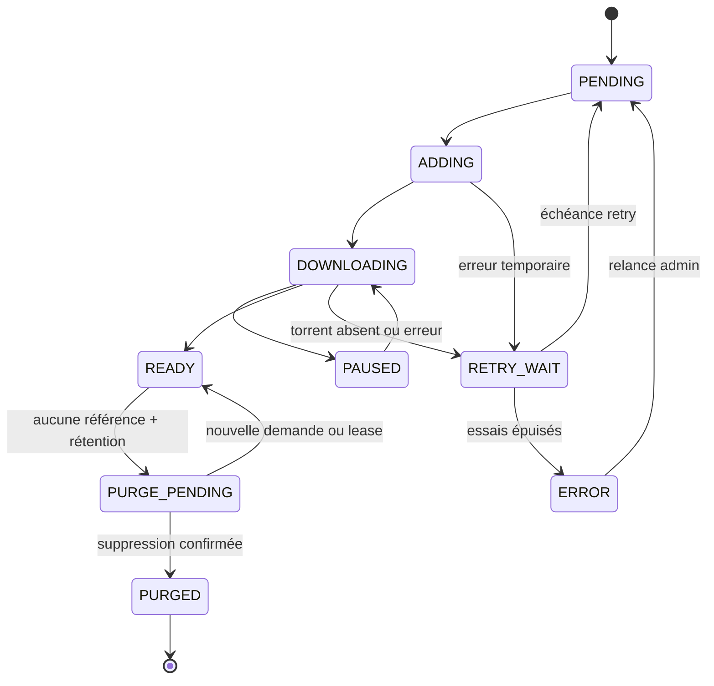
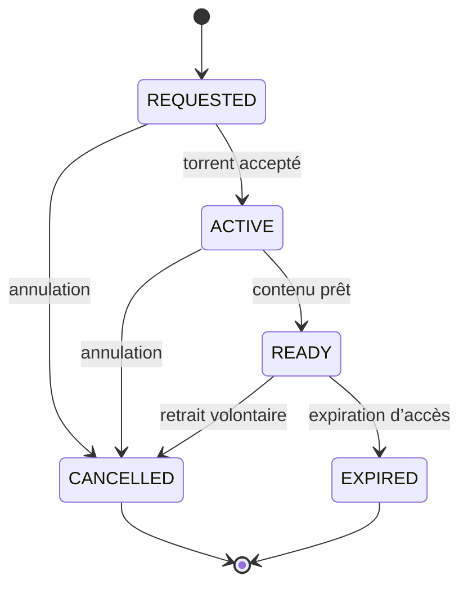
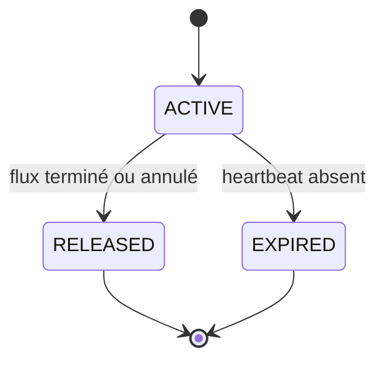
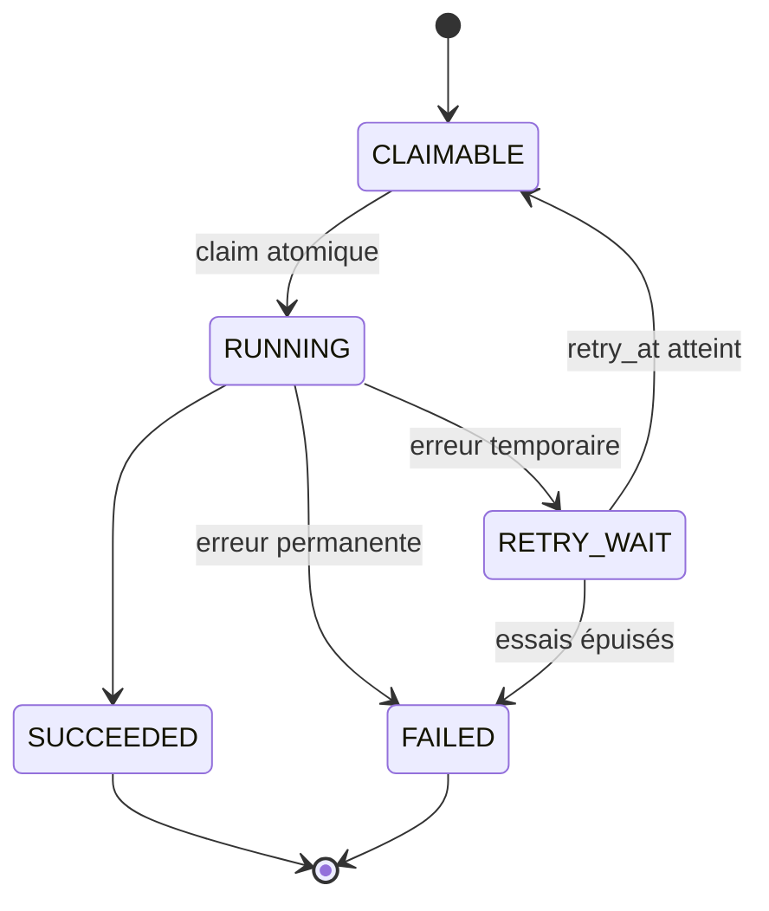
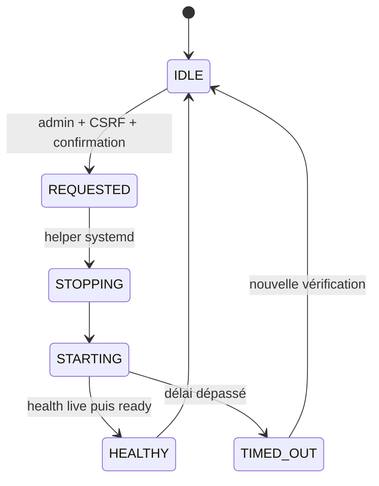

# Machines d’état de la V2

Ce document est normatif pour les enums, transitions et tests qui seront introduits à partir
de V2-03. Les noms en capitales correspondent aux futures valeurs persistées. Une transition
non listée est refusée par le domaine, même si qBittorrent remonte un état inattendu.

## Torrent géré

| État | Sens | Transition déclenchée par |
| --- | --- | --- |
| `PENDING` | Ligne SQL créée, ajout qB non confirmé | Worker |
| `ADDING` | Appel qB en cours/idempotence à vérifier | Worker |
| `DOWNLOADING` | Torrent présent, données incomplètes | Sync qB |
| `PAUSED` | Pause volontaire connue de WOS | Utilisateur/admin |
| `RETRY_WAIT` | Échec temporaire, `retry_at` défini | Backoff borné |
| `ERROR` | Échec durable ou incohérence nécessitant action | Worker/admin |
| `READY` | Données complètes et manifeste disponible | Sync qB |
| `PURGE_PENDING` | Plus de référence, rétention échue | Lifecycle |
| `PURGED` | Torrent WOS et données supprimés, audit conservé | Worker |

`qb_state` reste séparé de `state` afin de conserver la valeur opérationnelle normalisée
sans laisser qBittorrent piloter directement le domaine. Un état qB inconnu produit une
alerte et une réconciliation, jamais une transition destructive.

## Demande utilisateur

- `REQUESTED` : demande persistée, rattachement au torrent établi.
- `ACTIVE` : téléchargement ou traitement en cours.
- `READY` : accès utilisateur disponible ; `ready_at` est défini.
- `CANCELLED` : référence retirée par l’utilisateur ou un admin ; `cancelled_at` est défini.
- `EXPIRED` : accès arrivé à échéance selon la politique de rétention.

Une demande ne peut viser qu’un seul `ManagedTorrent` et appartient à un seul utilisateur.
Annuler une demande ne pause ni ne supprime le torrent tant qu’une autre demande active ou
prête existe.

## Lease de téléchargement

Une lease active protège le contenu contre la purge. Sa durée maximale et sa fréquence de
renouvellement proviennent de `.options`. L’expiration est vérifiable depuis PostgreSQL ; une
clé Redis peut accélérer la lecture mais ne constitue pas l’unique protection destructive.

## Job du worker

Le claim durable est garanti en PostgreSQL. Redis peut réduire la contention mais ne peut
pas être la seule queue d’un travail critique. Un worker interrompu laisse expirer son claim
et un autre worker peut reprendre l’opération idempotente.

## Redémarrage contrôlé de WOS

L’API écrit une requête exclusive et bornée ; le frontend perd temporairement la connexion,
sonde `/api/v1/health/live` avec backoff, puis confirme le retour de la readiness. Aucune
commande ou cible hôte ne vient du navigateur.

## Cache

Une entrée est `MISSING`, `FRESH` ou `STALE`. Une lecture `MISSING`/`STALE` interroge
PostgreSQL, puis tente un remplissage. Si Redis est indisponible, la réponse PostgreSQL est
retournée et le health passe en mode dégradé. Une mutation ne devient visible en cache
qu’après commit SQL ; l’échec d’invalidation réduit les performances mais ne change jamais
l’autorité métier.

## Invariants transactionnels

| Événement concurrent | Garantie |
| --- | --- |
| Deux uploads du même info-hash | Une ligne `ManagedTorrent` grâce à l’unicité SQL |
| Même utilisateur, même torrent | Une demande active grâce à une contrainte SQL |
| Cache vidé entre lookup et insert | La transaction SQL reste correcte |
| Annulation pendant la fin qB | Les transitions sont sérialisées/verrouillées en base |
| Nouvelle demande pendant `PURGE_PENDING` | Retour à `READY` avant toute suppression |
| Lease active pendant purge | Purge reportée |
| Worker arrêté après ajout qB | Réconciliation retrouve le torrent par info-hash/catégorie |
| qB renvoie un état inconnu | Aucune suppression ; état `ERROR`/alerte contrôlée |
